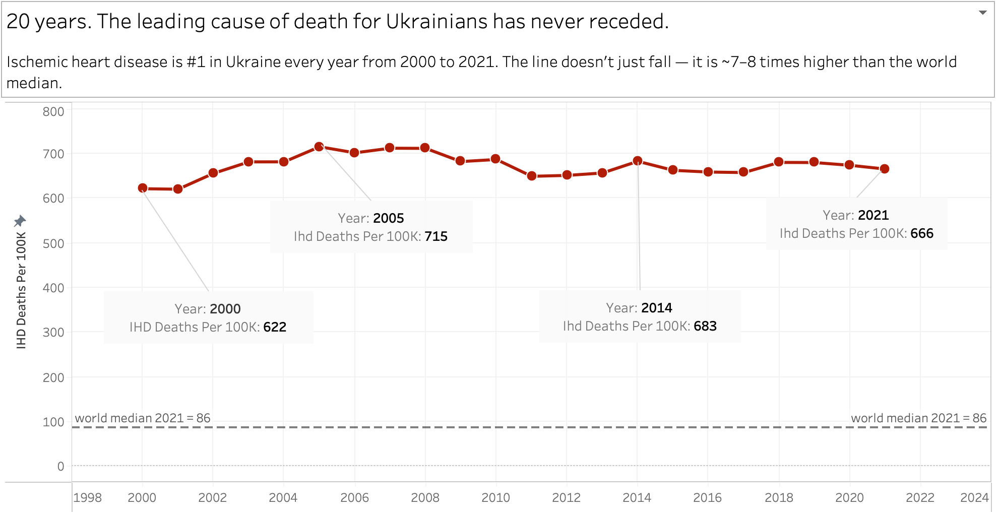

# Ischaemic Heart Disease — the Leading Cause of Death in Ukraine (2000–2021)

A short data story built from WHO Global Health Estimates: for two decades, the crude death rate from ischaemic heart disease (IHD) in Ukraine has stayed flat at a catastrophic level — never falling, and sitting roughly **7.7× above the world median**.



**Live visualization:** [Tableau Public — IHD, the leading cause of death for Ukraine, 2000–2021](https://public.tableau.com/app/profile/oleksandr.synichenko/viz/IHD-theleadingcauseofdeathforUkraine20002021cruderate/IHD_20)

---

## The finding

Ischaemic heart disease has been the #1 cause of death in Ukraine every single year from 2000 to 2021. The crude rate never dropped below 620 per 100,000, peaked at 715 in 2005, and ended the period **7.1% higher** than it started. There is no downward trend.

| Metric | Value |
|---|---|
| IHD crude death rate, Ukraine 2021 | **662.9** per 100,000 |
| World rank, 2021 (183 countries) | **#1** |
| World median by country, 2021 | 85.7 per 100,000 |
| Ukraine ÷ world median | **×7.7** |
| 20-year range (2000–2021) | 620–715 per 100,000, never below 620 |
| Change 2000 → 2021 | **+7.1%** |

The entire global top of the ranking is Eastern Europe and the post-Soviet space (Bulgaria, Belarus, Lithuania, Moldova, Latvia…). For scale, Ukraine's rate is ×2.1 Poland's, ×3.2 Germany's, ×6.9 France's.

---

## Data

- **Source:** WHO Global Health Estimates (GHE), *Leading causes of death* — latest release covers 2000–2021.
  - Tool: <https://www.who.int/data/gho/data/themes/mortality-and-global-health-estimates/ghe-leading-causes-of-death>
  - Ukraine country page: <https://data.who.int/countries/804>
- **Format:** OData JSON. Each file holds a `value[]` array of causes; the field used here is `VAL_DTHS_RATE100K_NUMERIC` (crude deaths per 100,000).
- **Files:**
  - `data/raw/Top_10_C_of_D_Ukr_YYYY.json` — 22 yearly files (2000–2021), top-10 causes for Ukraine.
  - `data/raw/GHE_FULL_DD.csv` — all countries, 2021, both sexes (`BTSX`), 24,522 rows / 183 countries (used for the world ranking).
  - `data/ukraine_ihd_2000_2021.csv` — the extracted two-column series (`year`, `ihd_deaths_per_100k`).

---

## Reproduce

**1. Extract the Ukraine time series** (bash + [`jq`](https://jqlang.github.io/jq/)):

```bash
for f in data/raw/Top_10_C_of_D_Ukr_*.json; do
  year=$(echo "$f" | grep -oE '[0-9]{4}')
  rate=$(jq -r '.value[] | select(.DIM_GHECAUSE_TITLE=="Ischaemic heart disease") | .VAL_DTHS_RATE100K_NUMERIC' "$f")
  echo "$year,$rate"
done | sort
```

**2. Compute the world median** (PostgreSQL):

```sql
CREATE TABLE ghe_2021 (
  country TEXT, year INT, cause TEXT, sex TEXT, dths_100k NUMERIC
);
-- run inside psql (prompt `ghe=#`):
-- \copy ghe_2021 FROM 'data/raw/GHE_FULL_DD.csv' WITH (FORMAT csv, HEADER true)

SELECT
  PERCENTILE_CONT(0.5) WITHIN GROUP (ORDER BY dths_100k) AS world_median,
  ROUND(AVG(dths_100k), 2)                               AS world_mean,
  COUNT(*)                                               AS n_countries
FROM ghe_2021
WHERE cause = 'Ischaemic heart disease';
-- world_median = 85.74 | world_mean = 116.40 | n_countries = 183
```

The **median** (not the mean) is used as the "world floor": the mean is pulled up by a handful of extreme countries, while the median describes a typical country and is robust to outliers.

---

## Methodological note (read this before quoting the numbers)

These are **crude** death rates. A flat crude line means *mortality did not fall* — it does **not** by itself prove *no medical progress was made*. Ukraine's population aged over this period, and IHD is overwhelmingly a disease of old age (the death rate rises roughly **800×** from ages 30–34 to 85+). An older population inflates a crude rate even if age-specific risk improves.

For claims about prevention or fair cross-country comparison, **age-standardized** rates are the correct metric. Ukraine and the post-Soviet region still rank among the highest in the world even after age standardization — so the story holds — but the exact magnitude would shift.

---

## Repository structure

```
.
├── README.md
├── ihd_ukraine_2000_2021.png        # hero chart
├── data/
│   ├── ukraine_ihd_2000_2021.csv    # extracted series (year, rate)
│   └── raw/                         # WHO GHE source files
│       ├── Top_10_C_of_D_Ukr_2000.json ... 2021.json
│       └── GHE_FULL_DD.csv
└── scripts/
    ├── extract_ihd.sh               # jq extractor (step 1 above)
    └── world_median.sql             # PostgreSQL median (step 2 above)
```

---

## Tech stack

`bash` + `jq` (JSON extraction) · Python (`json`, `glob`, `re`) · PostgreSQL (`PERCENTILE_CONT`) · Tableau Public (visualization)

## Data attribution & license

Data © World Health Organization — [Global Health Estimates](https://www.who.int/data/gho/data/themes/mortality-and-global-health-estimates).

- **Copyright / license:** [CC BY-NC-SA 3.0 IGO](https://creativecommons.org/licenses/by-nc-sa/3.0/igo/)
- **Permission type:** Public

> WHO supports open access to the published output of its activities as a fundamental part of its mission and a public benefit to be encouraged wherever possible.

This project is an independent analysis. WHO does **not** endorse and is **not** affiliated with this repository, its author, or any content, output, or analysis resulting from or related to `data.who.int`. The WHO emblem / `datadot` logo is not used here, in line with WHO policy.

For details, see the [WHO copyright policy](https://www.who.int/about/policies/publishing/copyright).

## Author

Oleksandr Synichenko — [Tableau Public](https://public.tableau.com/app/profile/oleksandr.synichenko)
